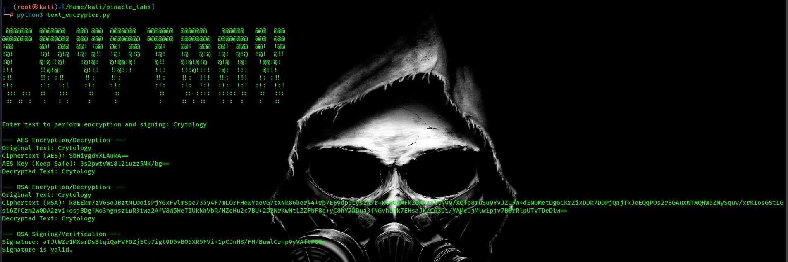

# CryptoBox: RSA, DSA, and AES Encryption

## Project Overview

**CryptoBox** is a Python-based cryptographic tool that implements three powerful encryption algorithms:
- **RSA (Rivest–Shamir–Adleman)**: An asymmetric encryption algorithm that uses public and private keys.
- **DSA (Digital Signature Algorithm)**: Used to create digital signatures for verifying the authenticity and integrity of messages.
- **AES (Advanced Encryption Standard)**: A symmetric encryption algorithm for encrypting and decrypting data using a shared secret key.

This project allows users to encrypt and decrypt messages using RSA, DSA, and AES, as well as sign and verify messages using DSA.

## Features
- **RSA Encryption/Decryption**: Securely encrypt and decrypt messages using public/private key pairs.
- **DSA Signing/Verification**: Create and verify digital signatures to ensure the authenticity and integrity of messages.
- **AES Encryption/Decryption**: Encrypt and decrypt data using a shared secret key.

## Requirements
To use this tool, you need Python 3 and the `pycryptodome` library installed on your system. You can install it using the following command:

```bash
pip install pycryptodome
```
## How to Use
Clone the Repository If you have not already, clone the repository using the following command:

```bash
git clone https://github.com/Dharan10/Cryptbox.git
cd CryptoBox
```
### Run the Script
To start using CryptoBox, you can run the Python script (text_encrypter.py):

```bash
python3 text_encrypter.py
```
Enter Text for Encryption/Signing After running the script, it will prompt you to enter the text you want to encrypt or sign.

```bash
Enter a text to perform Encryption:
```
Once you enter the text, the tool will:

```bash
Encrypt the text using RSA (asymmetric encryption).
Encrypt the text using AES (symmetric encryption).
Sign the text using DSA (digital signature).
Verify the signature using DSA.
```
## Example

# Cryptographic Algorithms: RSA, DSA, and AES

## 1. RSA (Rivest–Shamir–Adleman)
RSA is an asymmetric encryption algorithm, meaning it uses a pair of keys:

- **Public Key**: For encryption.
- **Private Key**: For decryption.

### How RSA Works:
1. A message is encrypted using the recipient's public key.
2. The recipient decrypts it using their private key.

### Use Case:
- Secure data transmission, such as exchanging sensitive information between parties.

### Example:

#### Encryption:
- Public key encrypts the message: `Hello`.
- Result: Ciphertext (garbled, secure form).

#### Decryption:
- Private key decrypts the ciphertext back to: `Hello`.

---

## 2. DSA (Digital Signature Algorithm)
DSA is used for digital signatures to:

- Prove the authenticity of a message.
- Ensure the message has not been altered (integrity).

### How DSA Works:
1. The sender generates a digital signature for the message using their private key.
2. The recipient verifies the signature using the sender’s public key.

### Use Case:
- Signing documents, software distribution, or digital certificates.

### Example:

#### Signing:
- Private key signs the message: `Transaction Approved`.
- Result: A unique signature attached to the message.

#### Verification:
- Public key verifies that the signature is valid and belongs to the sender.

---

## 3. AES (Advanced Encryption Standard)
AES is a symmetric encryption algorithm, meaning it uses a single key for:

- **Encryption**: Convert plaintext to ciphertext.
- **Decryption**: Convert ciphertext back to plaintext.

### How AES Works:
1. The same secret key encrypts and decrypts the message.
2. The key must be shared securely between the sender and receiver.

### Use Case:
- Encrypting data at rest (stored data) or in transit (e.g., Wi-Fi security).

### Example:

#### Encryption:
- Secret key encrypts: `Confidential Info`.
- Result: Ciphertext (unreadable form).

#### Decryption:
- Same secret key decrypts the ciphertext back to: `Confidential Info`.

---

## Comparison Table:

| **Feature**         | **RSA**                      | **DSA**                    | **AES**                       |
|---------------------|------------------------------|----------------------------|-------------------------------|
| **Type**            | Asymmetric encryption       | Digital signatures         | Symmetric encryption          |
| **Keys**            | Public/Private              | Private for signing, Public for verifying | Single key for encryption/decryption |
| **Speed**           | Slower                      | Faster                     | Fastest                      |
| **Use Case**        | Secure data transmission    | Authenticity and Integrity | Data encryption               |

---

## Practical Example:

Let’s say Alice wants to send a secret message and verify her identity:

### Encryption (RSA):
1. Alice uses Bob’s public key to encrypt: `Meet me at 5 PM`.
2. Bob decrypts it using his private key.

### Digital Signature (DSA):
1. Alice signs the message with her private key.
2. Bob verifies Alice’s identity using her public key.

### Encryption (AES):
1. Alice and Bob agree on a shared secret key.
2. Alice encrypts the message with the key.
3. Bob decrypts it using the same key.

This ensures **confidentiality (AES)**, **authentication (DSA)**, and **secure communication (RSA)**.
